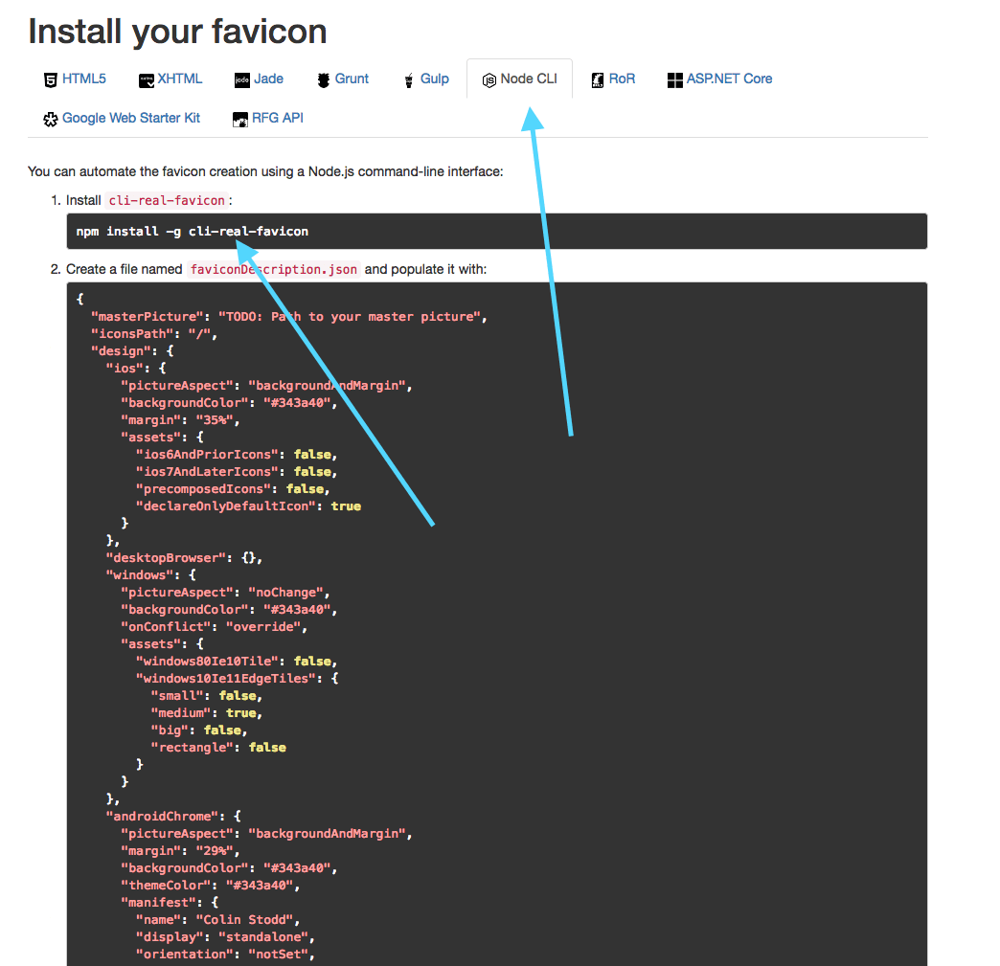

For just about all of my <a href="https://angular.io/" target="_blank" rel="noopener" title="Angular">Angular</a> applications I've used <a href="https://realfavicongenerator.net/" target="_blank" rel="noopener" title="Real Favicon Generator">Real Favicon Generator (RFG)</a> to generate the files for my Favicon icon. It's a great tool, and I highly suggest using it and donating to it. However, their guide only shows you how to add your favicon to a Node or HTML5 application/site. If you are using Angular there are a few more steps involved, so I've found a quick and painless way to use both the Node and HTML5 tools. I'll also show you how to add <a href="https://medium.com/@amberleyjohanna/seriously-though-what-is-a-progressive-web-app-56130600a093" target="_blank" rel="noopener" title="Medium">Progressive Web App (PWA)</a> meta tags so that you can add your newly created icons to your mobile home-screen. Lets get to it.

1. Head over to the <a href="https://realfavicongenerator.net/" target="_blank" rel="noopener" title="Real Favicon Generator">Real Favicon Generator</a> site and upload your icon. Note that your icon should have even/square dimensions and be at least 260px wide/high.

2. Set your icon settings; which basically allows you to play with the margin size, background size and what it will look like as a PWA icon on your mobile devices.

3. Once the <a href="https://realfavicongenerator.net/" target="_blank" rel="noopener" title="Real Favicon Generator">Real Favicon Generator</a> does its thing, you'll want to click on the "Node CLI" tab as seen in the image below.

    

4. Now you'll want to install the Real Favicon Generator CLI globally which helps to generate the files for you.
So run:
    ```bash
    npm install -g cli-real-favicon
    ```

5. Now that the CLI is installed, run this command from the root of your <a href="https://angular.io/" target="_blank" rel="noopener" title="Angular">Angular</a> app:
    ```bash
    touch faviconDescription.json && mkdir src/assets/outputDir
    ```
    This creates a generator file and output directory where the generator files are going to be placed in.

6. Now you'll want to copy that source code on the RFG site into the newly created `faviconDescription.json` file. You'll notice that there will be `TODO: Path to your master picture`.

7. You'll need to add your original icon that you uploaded to RFG into the newly created `src/assets/outputDir` directory. I named my image `favicon.png` so my path looks like this:

    ```json
    {
        "masterPicture": "src/assets/outputDir/favicon.png", // Update this line (Should be the same if you rename your image to favicon.png)
        "iconsPath": "/",
        "design": {
        ...
        ...
    ```

8. Now that you have copied and pasted that code and updated the     `"masterPicture"` path to your image path, you'll want to run this RFG CLI command to generate your new icons. So run this in your terminal:
    ```bash
    real-favicon generate faviconDescription.json faviconData.json src/assets/outputDir
    ```

    <div class="blurb"><i class="fad fa-whistle fa-lg text-gold"></i>&nbsp;&nbsp;
    Before reaching out to me with an error, please double and triple-check that you followed my instructions carefully. (1) Did you add your original pic to the output directory? (2) Did you copy the correct path?... I've tested this multiple times so I'm confident that it's working as expected. Nevertheless, if after checking your code and you still cannot get it to work, feel free to <a href="#getInTouch">contact me</a>.
    </div>

9. If everything went correctly you should now see your icons in your `src/assets/outputDir` directory.
10. Now go into your `angular.json` file and make sure it has the path to your favicon in the assets like so:

    ```json
     "assets": [
         "src/assets/outputDir/favicon.ico", // Add This line
         "src/assets",
         "src/sitemap.xml",
         "src/robots.txt"
     ],
    ```

11. Finally!!!!!!! One last step, go into your `index.html` file and add your meta tags. Mine looks like what's below. If you copy and paste my code just remember to update the color HEX's to be what you choose for your icon. You can find those HEX colors on the HTML5 tab on the RFG site. I've added some PWA tags too so when you add your site to your mobile devices' home screen, and launch the app, it will run like a PWA application and will use your new icon.
    ```html
        <!-- * Favicon * -->
        <link rel="icon" type="image/x-icon" href="./assets/outputDir/favicon.ico">
        <link rel="apple-touch-icon" sizes="180x180" href="./assets/outputDir/apple-touch-icon.png">
        <link rel="icon" type="image/png" sizes="32x32" href="./assets/outputDir/favicon-32x32.png">
        <link rel="icon" type="image/png" sizes="16x16" href="./assets/outputDir/favicon-16x16.png">
        <link rel="manifest" href="./assets/outputDir/site.webmanifest">
        <link rel="mask-icon" href="./assets/outputDir/safari-pinned-tab.svg" color="#d4327b">
        <meta name="msapplication-TileColor" content="#ffffff">
        <meta name="msapplication-config" content="./assets/outputDir/browserconfig.xml">
        <meta name="theme-color" content="#fcfcfc">
        <!-- * PWA * -->
        <meta name="viewport" content="width=device-width, initial-scale=1">
        <meta name="mobile-web-app-capable" content="yes">
        <meta name="apple-mobile-web-app-capable" content="yes">
        <meta name="apple-mobile-web-app-status-bar-style" content="white">
        <meta name="msapplication-starturl" content="/">
    ```
If you run into any issues or have any questions please let me know in the comments.
