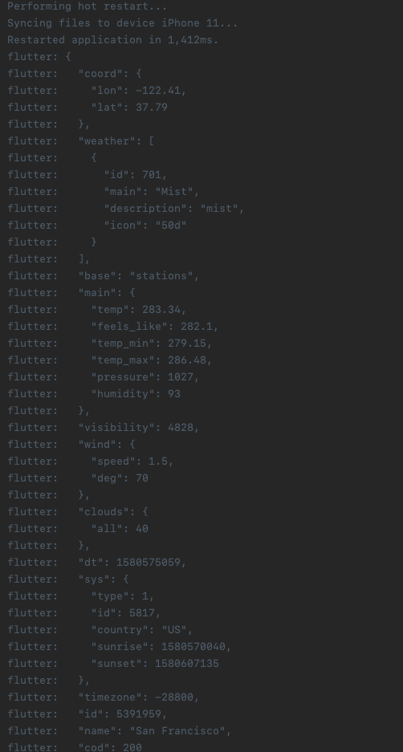

I've started learning <a href="https://flutter.dev/" target="_blank" rel="noopener">Flutter</a>, which is a framework for building mobile (but now also <a href="https://flutter.dev/web" target="_blank" rel="noopener">web</a>) apps on both iOS and Android devices using the same codebase. I'll let you do the research on <a href="https://flutter.dev/" target="_blank" rel="noopener">Flutter</a> but if you landed on this page, there's probably a good chance you already know about <a href="https://flutter.dev/" target="_blank" rel="noopener">Flutter</a>. Nevertheless, below is a function to help you "pretty-print" JSON data into your <a href="https://dart.dev/" target="_blank" rel="noopener">Dart</a> terminal.

FYI: <a href="https://dart.dev/" target="_blank" rel="noopener">Dart</a> is the programming language that <a href="https://flutter.dev/" target="_blank" rel="noopener">Flutter</a> uses, which are both created and maintained by <a href="https://www.google.com/" target="_blank" rel="noopener">Google</a>.

This function can be used just like you would with a `print('some message')` in Dart, but the parameter has to be a String of JSON.

```dart
import 'dart:convert'; //Don't forget to import this

void prettyPrintJson(String input) {
  const JsonDecoder decoder = JsonDecoder();
  const JsonEncoder encoder = JsonEncoder.withIndent('  ');
  final dynamic object = decoder.convert(input);
  final dynamic prettyString = encoder.convert(object);
  prettyString.split('\n').forEach((dynamic element) => print(element));
}
```

You would use/call it like so

```dart
prettyPrintJson(validJSON.toString());
```

Or in a realistic example using <a href="https://openweathermap.org/api" target="_blank" rel="noopener">OpenWeatherMap's API</a>:

```dart
import 'dart:convert';
import 'package:appName/utilities/constants.dart';
import 'package:appName/utilities/pretty_print.dart';
import 'package:http/http.dart' as http;

class NetworkHelper {
  Future<dynamic> getWeatherData({double lon, double lat}) async {
    final String url = 'https://api.openweathermap.org/data/2.5/weather?lat=$lat&lon=$lon&appid=$kApiKey';

    final http.Response response = await http.get(url);
    /*
    Below we are calling the prettyPrintJson() with the response.body
    But you need to make sure it's in String format.
    */
    prettyPrintJson(response.body.toString());
    if (response.statusCode == 200) {
      return jsonDecode(response.body);
    } else {
      print('Error: response.statusCode not 200. Was: ${response.statusCode}');
      return response.statusCode;
    }
  }
}
```
Below is an image of the output. As you can see it's much more legible to the human eye.


