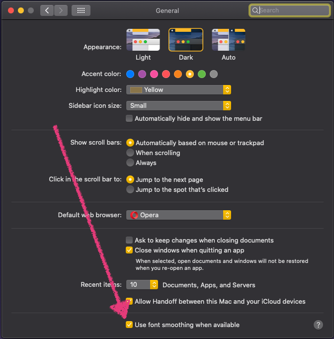
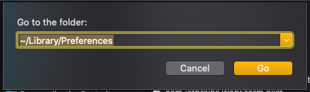
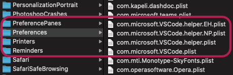
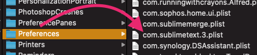
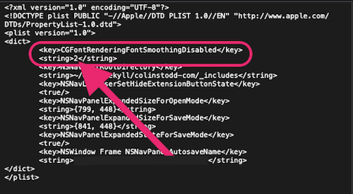

I recently upgraded my MAC from <a href="https://support.apple.com/macos/mojave" target="_blank" rel="noopener">Mojave</a> to <a href="https://www.apple.com/macos/catalina/" target="_blank" rel="noopener">Catalina</a>, all went well but I noticed that my text editor fonts were looking thinner than normal. I recall this happening with the <a href="https://support.apple.com/macos/mojave" target="_blank" rel="noopener">Mojave</a> update, so I sort of knew where to begin looking, but I couldn't find exactly what I needed in one spot so I'm going to post it here.  ***I am by no means an expert on these commands, I'm just posting what worked for me***.

Many people had to play with these settings because not every external display is the same, so what I've posted here might not fit your setup exactly. It took some trial and error, but hopefully these commands will help you. As you'll see below, everything can be reverted (<a href="#revert">see the bottom of the page</a>) and the commands won't do any serious damage to your MAC.

<div class="blurb"><i class="fad fa-comment-alt-exclamation fa-lg text-yellow"></i>&nbsp;&nbsp; Note: Every time you run one of these commands, you'll have to log out to see the changes. You can do so by pressing <code>command</code> + <code>shift</code> + <code>Q</code>.</div>
___

## What Worked For Me:
You'll want to check to see if you have your font smoothing enabled or disabled in your `Settings` > `General` tab as seen in the image. This also plays a role... I left mine on.

<div class="container">
  <div class="row">
    <div class="one-third column">&nbsp;</div>
      <div class="one-third column">
        
      </div>
    <div class="one-third column">&nbsp;</div>
  </div>
</div>

Even though you checked the checkbox in settings, We're going to assure that font smoothing is on system-wide by running the command below in your <a href="https://www.iterm2.com/" target="_blank" rel="noopener" title="iTerm 2">favorite terminal application</a> `/Applications/Utilities/Terminal.app`. The `-g` stands for `global`.  <a href="#textEditors" title="Scroll down fix individual apps">Further down</a> in the tutorial I show you how to change the fonts on a per-app basis (examples shown <a href="#textEditors" title="Scroll down to the Text Editors Section">down the page <i class="fad fa-level-down-alt"></i></a> for text editors).

<div class="blurb">
<i class="fad fa-info-circle fa-lg text-yellow"></i>&nbsp;&nbsp; FYI: I've found that most apps built with <a href="https://www.electronjs.org/" target="_blank" rel="noopener">Electron</a> need adjustments, whereas the native OSX apps look fine.
</div>

```bash
defaults write -g CGFontRenderingFontSmoothingDisabled -bool FALSE
```

And then I ran the code below to add strong font smoothing:

```bash
defaults -currentHost write -globalDomain AppleFontSmoothing -int 2
```

Log out, and log back in.

If this worked; great! If not, you can try these options below. My setup is still not perfect but I can live with what I have. You might have to play around with a few different combinations.  I really hope <a href="https://apple.com/support" target="_blank" rel="noopener">Apple</a> addresses this in the near future.

---
## Adjusting Fonts Globally:

If you're at this section you're probably not happy with the results above 😞. What you'll most likely need to do is try different combinations. I recommend that you write down what worked and where it worked. e.g. if what we ran above helped with OS X's fonts but messed up some apps then take note of that so you can apply commands to those specific apps (basically debug). Im not exaggerating when I say that I spent nearly 8 hours doing this (also searching for answers which is why I'm writing this post).

Nevertheless, here's the same command as above but I've laid them out so that you can copy and paste which one you want to try. Once you get your OSX system fonts to where you like them (ie. the menubar at the top, Finder and stock/default OSX apps), you can <a href="#textEditors" title="Scroll down to the Text Editors Section">scroll down <i class="fad fa-level-down-alt"></i></a> to the next section to update apps individually.

`1` - **Light** font smoothing
```bash
defaults -currentHost write -globalDomain AppleFontSmoothing -int 1
```
`2` - **Medium** font smoothing
```bash
defaults -currentHost write -globalDomain AppleFontSmoothing -int 2
```
`3` - **Strong** font smoothing
```bash
defaults -currentHost write -globalDomain AppleFontSmoothing -int 3
```

<div id="textEditors" name="textEditors"></div>
___

## Adjusting Fonts Individually (Text Editors and Apps):

I had issues with my text editor fonts so I'll use those as examples, but you can locate and adjust any app you'd like using the same method.

### <i class="fad fa-check-circle fa-lg text-yellow"></i> VSCode:

<div class="row">
  <div class="six columns">
    
  </div>
  <div class="six columns">
    
  </div>
</div>

To upgrade your apps individually you can locate their preference files by going to `Finder` and selecting `Go` or by pressing `shift` + `command` + `G` and searching `~/Library/Preferences`.  You can then scroll through to locate the app and adjust it's font smoothing level. As you can see in the images above, I've highlighted the VSCode files that are updated below. VSCode is built with <a href="https://www.electronjs.org/" target="_blank" rel="noopener" title="Electron JS">Electron</a> and I've found that those apps don't need font smoothing on my monitor so I set mine to `0`.

```bash
defaults write com.microsoft.VSCode CGFontRenderingFontSmoothingDisabled 0
defaults write com.microsoft.VSCode.helper CGFontRenderingFontSmoothingDisabled 0
defaults write com.microsoft.VSCode.helper.EH CGFontRenderingFontSmoothingDisabled 0
defaults write com.microsoft.VSCode.helper.NP CGFontRenderingFontSmoothingDisabled 0
```

### <i class="fad fa-check-circle fa-lg text-yellow"></i> Webstorm:

<div class="row">
	<div class="six columns">
		
	</div>
</div>

You'll notice the `d9f3b04` in my <a href="https://www.jetbrains.com/webstorm/" target="_blank" title="Webstorm" rel="noopener">Webstorm</a> file name. That is probably going to be different for you depending on your Webstorm download. You'll have check for yourself.

```bash
defaults write com.jetbrains.webstorm.d9f3b04 CGFontRenderingFontSmoothingDisabled 0
```

### <i class="fad fa-check-circle fa-lg text-yellow"></i> Sublime Text 3.2 (example):

<div class="row">
  <div class="six columns">
    
  </div>
  <div class="six columns">
    
  </div>
</div>

Here's another example of how I updated <a href="https://www.sublimetext.com/blog/articles/sublime-text-3-point-2" target="_blank" title="Sublime Text 3.2" rel="noopener">Sublime Text 3</a>. If you look at the image right above (bottom if you're on mobile) the level that I set mine to be `2` is set in `<string>2</string>`:

```bash
defaults write com.sublimetext.3 CGFontRenderingFontSmoothingDisabled 2
```

___

<div id="revert"></div>

## Revert back to OSX default:
No need to worry if you messed things up, you can set everything back to it's default OSX Catalina state:

**Removes custom font smoothing:**
```bash
defaults -currentHost delete -globalDomain AppleFontSmoothing
```

**Puts it back to light font smoothing:**
```bash
defaults write -g CGFontRenderingFontSmoothingDisabled -bool True
```

---

Hopefully this helped you. If so, I'd appreciate a thumbs up below or let me know in the comments. If you have anymore info regarding this or you see something off please <a href="#getInTouch">let me know</a>, I'm happy to work with you to post any updates.

Happy Coding!!!! 😃