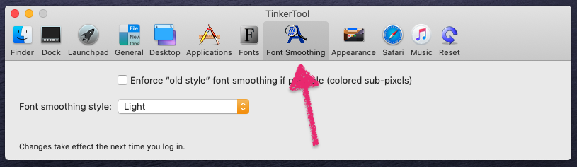
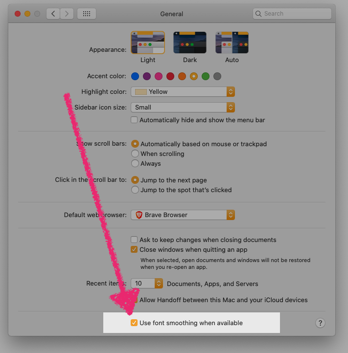
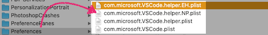
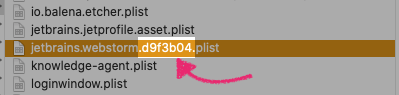
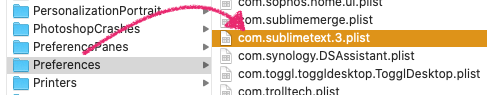
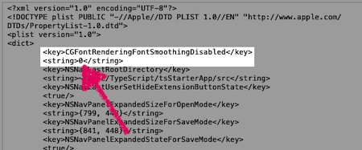

<div class="blurb">
<h2 class="text-yellow"><i class="fad fa-traffic-cone"></i> UPDATE <i class="fad fa-traffic-cone"></i></h2>
For those of you that are unfamiliar with the Terminal/command line, I'm happy to let you know that I came across a post on <a href="https://medium.com/macoclock/adjust-hidden-settings-on-your-mac-f29f4beaaf50" target="_blank" rel="noopener">Medium</a> that introduced me to a OSX app which allows you to do most of theses commands below from a free application called <a href="https://www.bresink.com/osx/TinkerTool.html" target="_blank" rel="noopener">TinkerTool</a>.  As you can see in the image below there is a tab called "Font Smoothing", and you'll see that there are options for you to do much of what I
explain below. However, this app is limited and does not let you adjust font smoothing on a per-app basis (that I explain below). But if all you need is to set the smoothing globally, than this might be a better method.
<p></p>
</div>


<hr/>

<h2 class="text-green"><em><i class="fad fa-page-break"></i>&nbsp; Start of original post</em></h2>

I recently upgraded my MAC from <a href="https://support.apple.com/macos/mojave" target="_blank" rel="noopener">Mojave</a> to <a href="https://www.apple.com/macos/catalina/" target="_blank" rel="noopener">Catalina</a>, then also to <a href="https://www.apple.com/macos/big-sur/" target="_blank" title="macOS Big Sur Download" rel="noopener">macOS Big Sur</a>, all went well but I noticed that my text editor fonts were looking thinner than normal. I recall this happening with the <a href="https://support.apple.com/macos/mojave" target="_blank" rel="noopener">Mojave</a> update, so I sort of knew where to begin looking, but I couldn't find exactly what I needed in one spot so I'm going to post it here.  ***I am by no means an expert on these commands, I'm just posting what worked for me***.

Many people had to play with these settings because not every external display is the same, so what I've posted here might not fit your setup exactly. It took some trial and error, but hopefully these commands will help you. As you'll see below, everything can be reverted (<a href="#revert">see the bottom of the page</a>) and the commands won't do any serious damage to your MAC.

<div class="blurb"><i class="fad fa-comment-alt-exclamation fa-lg"></i>&nbsp;&nbsp; Note: Every time you run one of these commands, you'll have to log out to see the changes. You can do so by pressing <code>command</code> + <code>shift</code> + <code>Q</code>.</div>
___

## What Worked For Me:
You'll want to check to see if you have your font smoothing enabled or disabled in your `Settings` > `General` tab as seen in the image. This also plays a role... I left mine on.

<div class="container">
  <div class="row">
    <div class="one-third column">&nbsp;</div>
      <div class="one-third column">
        
      </div>
    <div class="one-third column">&nbsp;</div>
  </div>
</div>

Even though you checked the checkbox in settings, We're going to assure that font smoothing is on system-wide by running the command below in your <a href="https://www.iterm2.com/" target="_blank" rel="noopener" title="iTerm 2">favorite terminal application</a> `/Applications/Utilities/Terminal.app`. The `-g` stands for `global`.  <a href="#textEditors" title="Scroll down fix individual apps">Further down</a> in the tutorial I show you how to change the fonts on a per-app basis (examples shown <a href="#textEditors" title="Scroll down to the Text Editors Section">down the page <i class="fad fa-level-down-alt"></i></a> for text editors).

```bash
defaults write -g CGFontRenderingFontSmoothingDisabled -bool FALSE
```
<button class="button small copy-btn pull-right"
   title="Copy to clipboard"
   data-clipboard-text="defaults write -g CGFontRenderingFontSmoothingDisabled -bool FALSE">
     <i class="fad fa-clipboard-list"></i> Copy
</button>

And then I ran the code below to add strong font smoothing:

```bash
defaults -currentHost write -globalDomain AppleFontSmoothing -int 2
```
<button class="button small copy-btn pull-right"
   title="Copy to clipboard"
   data-clipboard-text="defaults -currentHost write -globalDomain AppleFontSmoothing -int 2">
     <i class="fad fa-clipboard-list"></i> Copy
</button>
Log out, and log back in.


---
## Adjusting Fonts Globally:

If you're at this section you're probably not happy with the results above 😞. What you'll most likely need to do is try different combinations. I recommend that you write down what worked and where it worked. e.g. if what we ran above helped with OS X's fonts but messed up some apps then take note of that so you can apply commands to those specific apps (basically debug). Im not exaggerating when I say that I spent nearly 8 hours doing this (also searching for answers which is why I'm writing this post).

Nevertheless, here's the same command as above but I've laid them out so that you can copy and paste which one you want to try. Once you get your OSX system fonts to where you like them (ie. the menubar at the top, Finder and stock/default OSX apps), you can <a href="#textEditors" title="Scroll down to the Text Editors Section">scroll down <i class="fad fa-level-down-alt"></i></a> to the next section to update apps individually.

`1` - **Light** font smoothing
```bash
defaults -currentHost write -globalDomain AppleFontSmoothing -int 1
```
`2` - **Medium** font smoothing
```bash
defaults -currentHost write -globalDomain AppleFontSmoothing -int 2
```
`3` - **Strong** font smoothing
```bash
defaults -currentHost write -globalDomain AppleFontSmoothing -int 3
```
<button class="button small copy-btn pull-right"
   title="Copy to clipboard"
   data-clipboard-text="defaults -currentHost write -globalDomain AppleFontSmoothing -int 1">
     <i class="fad fa-clipboard-list"></i> Copy
</button>

<p>&nbsp;</p>

<div id="textEditors" name="textEditors"></div>

___

## Adjusting Fonts Individually (Text Editors and Apps):

I had issues with my text editor fonts so I'll use those as examples, but you can locate and adjust any app you'd like using the same method below.

<div class="blurb">
<strong><i class="fad fa-books fa-lg"></i>&nbsp; Here's a color-coded script in <span class="text-gold">gold</span> to help you visualize the values to update.</strong>

<ol class="alt">
  <li>Keep as <code>defaults write</code>.</li>
  <li class="text-gold">Application <code>.plist</code> filename that you want to locate and update.</li>
  <li>Keep as <code>CGFontRenderingFontSmoothingDisabled</code>.</li>
  <li class="text-gold">Select level of font smoothing <code>0</code> - <code>3</code>.</li>
</ol>

<pre><code><sup>1</sup>defaults write <span class="text-gold"><sup>2</sup>com.microsoft.VSCode</span> <sup>3</sup>CGFontRenderingFontSmoothingDisabled <span class="text-gold"><sup>4</sup>0</span>
</code></pre>

(More examples further down the page)
</div>

### <i class="fad fa-check-circle fa-lg text-yellow"></i> VSCode:

<div class="row">
  <div class="six columns">
    
  </div>
  <div class="six columns">
    
  </div>
</div>

To upgrade your apps individually you can locate their preference files by going to `Finder` and selecting `Go` or by pressing `shift` + `command` + `G` and searching `~/Library/Preferences`.  Then scroll through to locate the apps' filename so we can adjust the font smoothing level. As you can see in the images above I've outlined the VSCode files that I update below.


<div class="blurb">
<i class="fad fa-info-circle fa-lg"></i>&nbsp;&nbsp; FWIW: VSCode is built with <a href="https://www.electronjs.org/apps" target="_blank" rel="noopener" title="Apps built with ElectronJS">Electron JS</a> and I've found that Electron apps don't need much font smoothing so I typically set them to <code>0</code>.
</div>


```bash
defaults write com.microsoft.VSCode CGFontRenderingFontSmoothingDisabled 0
defaults write com.microsoft.VSCode.helper CGFontRenderingFontSmoothingDisabled 0
defaults write com.microsoft.VSCode.helper.EH CGFontRenderingFontSmoothingDisabled 0
defaults write com.microsoft.VSCode.helper.NP CGFontRenderingFontSmoothingDisabled 0
```
<button class="button small copy-btn pull-right"
   title="Copy to clipboard"
   data-clipboard-text="defaults write com.microsoft.VSCode CGFontRenderingFontSmoothingDisabled 0
defaults write com.microsoft.VSCode.helper CGFontRenderingFontSmoothingDisabled 0
defaults write com.microsoft.VSCode.helper.EH CGFontRenderingFontSmoothingDisabled 0
defaults write com.microsoft.VSCode.helper.NP CGFontRenderingFontSmoothingDisabled 0">
     <i class="fad fa-clipboard-list"></i> Copy
</button>

### <i class="fad fa-check-circle fa-lg text-yellow"></i> Webstorm:

<div class="row">
  <div class="six columns">
    
  </div>
</div>

You'll notice the `d9f3b04` in my <a href="https://www.jetbrains.com/webstorm/" target="_blank" title="Webstorm" rel="noopener">Webstorm</a> file name. That is probably going to be different for you depending on your Webstorm download. You'll have to check for yourself.

```bash
defaults write jetbrains.webstorm.d9f3b04 CGFontRenderingFontSmoothingDisabled 0
```
<button class="button small copy-btn pull-right"
   title="Copy to clipboard"
   data-clipboard-text="defaults write jetbrains.webstorm.d9f3b04 CGFontRenderingFontSmoothingDisabled 0">
     <i class="fad fa-clipboard-list"></i> Copy
</button>

### <i class="fad fa-check-circle fa-lg text-yellow"></i> Sublime Text 3.2 (example):

<div class="row">
  <div class="six columns">
    
  </div>
  <div class="six columns">
    
  </div>
</div>

Here's a final example of how I updated <a href="https://www.sublimetext.com/blog/articles/sublime-text-3-point-2" target="_blank" title="Sublime Text 3.2" rel="noopener">Sublime Text 3</a>. If you look at the image above you'll notice that the string gets added to the file <u><strong>AFTER</strong></u> I run the command; You can see that `0` is set to `<string>0</string>` in the `.plist` file. I find that turning off font smoothing for Sublime gives me the thickest fonts:

```bash
defaults write com.sublimetext.3 CGFontRenderingFontSmoothingDisabled 0
```
<button class="button small copy-btn pull-right"
   title="Copy to clipboard"
   data-clipboard-text="defaults write com.sublimetext.3 CGFontRenderingFontSmoothingDisabled 0">
     <i class="fad fa-clipboard-list"></i> Copy
</button>

<p>&nbsp;</p>

___

<div id="revert"></div>

## Revert back to OSX default:
No need to worry if you messed things up, you can set everything back to it's default OSX Catalina and macOS Big Sur state:

**Removes custom font smoothing:**

```bash
defaults -currentHost delete -globalDomain AppleFontSmoothing
```
<button class="button small copy-btn pull-right"
   title="Copy to clipboard"
   data-clipboard-text="defaults -currentHost delete -globalDomain AppleFontSmoothing">
     <i class="fad fa-clipboard-list"></i> Copy
</button>

**Reverts back to light font smoothing:**

```bash
defaults write -g CGFontRenderingFontSmoothingDisabled -bool True
```
<button class="button small copy-btn pull-right"
   title="Copy to clipboard"
   data-clipboard-text="defaults write -g CGFontRenderingFontSmoothingDisabled -bool True">
     <i class="fad fa-clipboard-list"></i> Copy
</button>


Hopefully this helped you or you were able to learn something about OSX package/file management...

I really hope <a href="https://apple.com/support" target="_blank" rel="noopener">Apple</a> addresses this, but until they do, I'll try to keep this post updated. If you have any info regarding this or you see something off, please <a href="#getInTouch">let me know</a>.

Happy coding 🤓

---