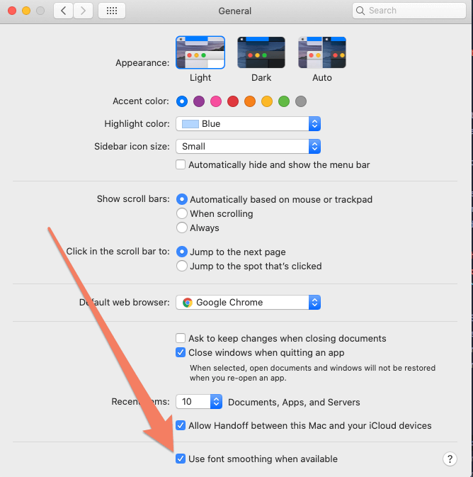

I recently upgraded my MAC operating system from <a href="https://support.apple.com/macos/mojave" target="_blank" rel="noopener">Mojave</a> to <a href="https://www.apple.com/macos/catalina/" target="_blank" rel="noopener">Catalina</a>, all went well but I noticed that my text editor fonts were looking thinner than normal. I recall this happening with the <a href="https://support.apple.com/macos/mojave" target="_blank" rel="noopener">Mojave</a> update, so I sort of knew where to begin looking, but I couldn't find exactly what I needed in one spot so I'm going to post it here.  ***I am by no means an expert on these commands, I'm just posting what worked for me***.

Many people had to play with these settings because not every external display is the same, so what I've posted here might not fit your setup exactly. It took some trial and error, but hopefully these commands will help you. As you'll see below, everything can be reverted (<a href="#revert">see the bottom of the page</a>) and the commands wont do any serous damage to your MAC.

***Note: That after every time you run these commands, you'll have to log out of your computer and log back in for it to take effect (sucks, but true). You can do so by pressing*** `command` + `shift` + `Q`.


### First:
You'll want to note if you have your font smoothing enabled or disabled in your `Settings` > `General` tab as seen in the image. This also plays a role... I left mine on.

<div class="row">
  <div class="8u$">
    
  </div>
</div>

You can turn on font smoothing system wide by running the command below in your favorite terminal application `/Applications/Utilities/Terminal.app`; the `-g` stands for "global". If you know the app (examples shown down the page for text editors) you can apply these commands to those apps specifically versus the entire (global) OS/system.... ***Side Note: I've found that apps built with Electron behave differently than native OSX apps***:

```bash
defaults write -g CGFontRenderingFontSmoothingDisabled -bool FALSE
```

And then I ran the code below to add strong font smoothing:

```bash
defaults -currentHost write -globalDomain AppleFontSmoothing -int 3
```

Log out, and log back in.

If this worked, great; if not, you can try these options below. My setup is still not perfect (some apps are still weird, as in some websites show really thin fonts), but I can live with what I have. You might have to play around with a few different combinations.  I really hope <a href="https://apple.com/support" target="_blank" rel="noopener">Apple</a> addresses this in the near future, it's become really annoying.

---

If you want to change the smoothing thickness of the fonts globally, you can do so with one of these commands; depending on the number you want:

`1` - **Light** font smoothing
```bash
defaults -currentHost write -globalDomain AppleFontSmoothing -int 1
```
`2` - **Medium** font smoothing
```bash
defaults -currentHost write -globalDomain AppleFontSmoothing -int 2
```
`3` - **Strong** font smoothing
```bash
defaults -currentHost write -globalDomain AppleFontSmoothing -int 3
```
___

I had issues with my text editor fonts. I use <a href="https://code.visualstudio.com/" target="_blank" rel="noopener">VSCode</a> and the <a href="https://www.jetbrains.com/" target="_blank" rel="noopener">IntelliJ IDEA</a>'s IDE's--mostly (sometimes <a href="https://www.sublimetext.com/" target="_blank" rel="noopener">Sublime Text</a>), and my <a href="https://code.visualstudio.com/" target="_blank" rel="noopener">VSCode</a> fonts were thinner than normal. To fix those, I had to run these four commands in my terminal. Note that the trailing `0` can be changed to either `1`, `2` or `3` depending on the thickness you are looking for.

### VSCode Commands:

```bash
defaults write com.microsoft.VSCode CGFontRenderingFontSmoothingDisabled 0
defaults write com.microsoft.VSCode.helper CGFontRenderingFontSmoothingDisabled 0
defaults write com.microsoft.VSCode.helper.EH CGFontRenderingFontSmoothingDisabled 0
defaults write com.microsoft.VSCode.helper.NP CGFontRenderingFontSmoothingDisabled 0
```

---
### Webstorm Commands:

```bash
defaults write com.jetbrains.webstorm CGFontRenderingFontSmoothingDisabled 0
defaults write com.jetbrains.webstorm.helper CGFontRenderingFontSmoothingDisabled 0
defaults write com.jetbrains.webstorm.helper.EH CGFontRenderingFontSmoothingDisabled 0
defaults write com.jetbrains.webstorm.helper.NP CGFontRenderingFontSmoothingDisabled 0
```
___

<div id="revert"></div>

### If you messed everything up:
No need to worry you can set everything back to it's default OSX Catalina state:

**Removes custom font smoothing:**
```bash
defaults -currentHost delete -globalDomain AppleFontSmoothing
```

**Puts it back to light font smoothing:**
```bash
defaults write -g CGFontRenderingFontSmoothingDisabled -bool True
```


I'm yet to find a fix for the IntelliJ IDE. I know it would be similar to the WebStorm and VSCode snippets, but I haven't found one that works yet. If you know, please contact me or let me know in the comments so that I can include those here to help future on-lookers. Also, if you have any more info, I'm happy to work with you to post those on this page.  Hope this helps some of you!

Happy Coding!!!! 😃